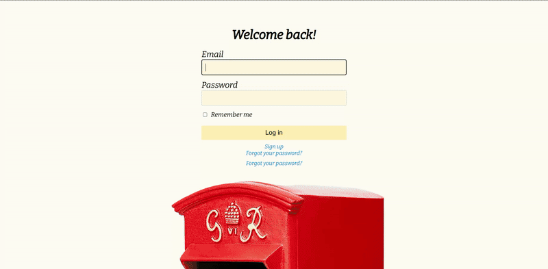

# 📮 Posts : A Text based social Media app. 

## Where you can post, comment, like & follow!

### Demo's 


### Features

   - User Authentication.
   - Follow System.
   - Posts and engagement.
   - Feed of followed users.

### Prerequisite
    - Install Postgres

### Installation
1. Clone this repository:
```bash
git clone https://github.com/Surveinit/Posts
```

2. Change directory
```bash
cd posts 
```

3. Install the required gems:
```bash
bundle install
```

4. Create DB:
```bash
rails db:create
```

5. Migrate DB:
```bash
rails db:migrate
```

6. Run the Rails server:
```bash
rails server
```
5. Visit the app in your browser:
```
http://localhost:3000
```

#### Thanks [The Odin Project](https://www.theodinproject.com) for everything!
